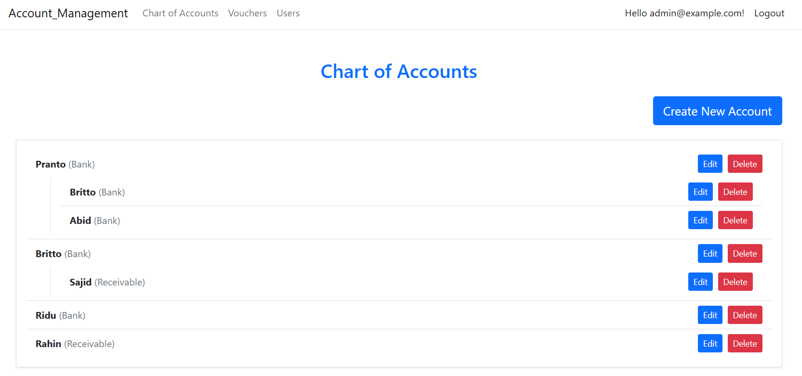
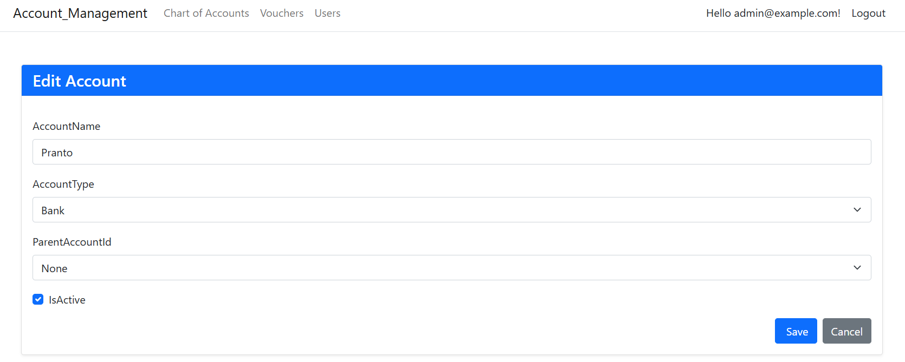
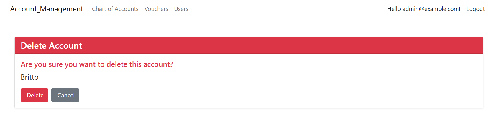
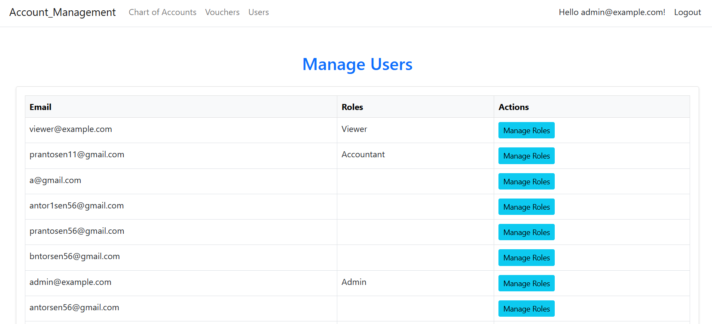

# Account Management
A web application built with ASP.NET Core and Identity for user authentication, role-based authorization, and permission management. The project includes user registration with a default "Viewer" role, role-based access control, and a custom stored procedure for managing role permissions.

# Live Link Of This Project
- https://www.accountmanagementsystem.somee.com/

## Credentials
- For Admin
    ```bash
    Email: admin@example.com
    Password: Admin@123
    ```
- For Accountant
    ```bash
    Email: prantosen11@gmail.com
    Password: Prantosen11@
    ```

- For Viewer
    ```bash
    Email: viewer@example.com
    Password: Viewer@1234
    ```

## Features
- User Authentication: Register, login, and logout using ASP.NET Core Identity.


- Role-Based Authorization: Supports roles like Admin, Accountant, and Viewer.


- Default Role Assignment: New users are automatically assigned the "Viewer" role upon registration.


- Permission Management: Uses a stored procedure (sp_ManageRolePermissions) to manage role permissions for modules (e.g., CanView, CanEdit, CanDelete).


- Database: SQL Server with Entity Framework Core for data persistence.


- Razor Pages: Default Identity UI for user management and authentication.

## Project Setup
### 1. Clone the Repository
```bash
git clone https://github.com/Pranto-Sen/Account-Management.git
cd Account-Management
```
### 2. Configure the Database
- Open appsettings.json and update the DefaultConnection string to point to your SQL Server instance:
```bash
"ConnectionStrings": {
  "DefaultConnection": "Server=your-server-name;Database=AccountManagement;Trusted_Connection=True;Encrypt=False;"}
```
### 3. Apply Migrations
```bash
Add-Migration InitialMigration
Update-Database
```
### 4. Create the Stored Procedure
```bash
CREATE PROCEDURE [dbo].[sp_ManageChartOfAccounts]
    @Action VARCHAR(50),
    @AccountId INT = NULL, -- Optional for INSERT and SELECT, required for UPDATE/DELETE
    @AccountName NVARCHAR(100) = NULL,
    @AccountType NVARCHAR(50) = NULL,
    @ParentAccountId INT = NULL,
    @IsActive BIT = NULL
AS
BEGIN
    IF @Action = 'SELECT'
    BEGIN
        SELECT AccountId, AccountName, AccountType, ParentAccountId, IsActive
        FROM Accounts
        WHERE IsActive = 1;
    END
    ELSE IF @Action = 'INSERT'
    BEGIN
        INSERT INTO Accounts (AccountName, AccountType, ParentAccountId, IsActive)
        VALUES (@AccountName, @AccountType, @ParentAccountId, @IsActive);
    END
    ELSE IF @Action = 'UPDATE'
    BEGIN
        IF @AccountId IS NULL
            RAISERROR ('AccountId is required for UPDATE operation.', 16, 1);
        ELSE
            UPDATE Accounts
            SET AccountName = @AccountName,
                AccountType = @AccountType,
                ParentAccountId = @ParentAccountId,
                IsActive = @IsActive
            WHERE AccountId = @AccountId;
    END
    ELSE IF @Action = 'DELETE'
    BEGIN
        IF @AccountId IS NULL
            RAISERROR ('AccountId is required for DELETE operation.', 16, 1);
        ELSE
            UPDATE Accounts
            SET IsActive = 0
            WHERE AccountId = @AccountId;
    END
END;
GO


CREATE PROCEDURE [dbo].[sp_ManageRolePermissions]
    @Action VARCHAR(50),
    @RoleId NVARCHAR(450) = NULL, -- Make RoleId optional
    @ModuleName NVARCHAR(50) = NULL,
    @CanView BIT = NULL,
    @CanEdit BIT = NULL,
    @CanDelete BIT = NULL
AS
BEGIN
    IF @Action = 'SELECT'
    BEGIN
        SELECT RoleId, ModuleName, CanView, CanEdit, CanDelete
        FROM RolePermissions;
    END
    ELSE IF @Action = 'UPDATE'
    BEGIN
        IF EXISTS (SELECT 1 FROM RolePermissions WHERE RoleId = @RoleId AND ModuleName = @ModuleName)
        BEGIN
            UPDATE RolePermissions
            SET CanView = @CanView,
                CanEdit = @CanEdit,
                CanDelete = @CanDelete
            WHERE RoleId = @RoleId AND ModuleName = @ModuleName;
        END
        ELSE
        BEGIN
            INSERT INTO RolePermissions (RoleId, ModuleName, CanView, CanEdit, CanDelete)
            VALUES (@RoleId, @ModuleName, @CanView, @CanEdit, @CanDelete);
        END
    END
END;
GO


CREATE PROCEDURE [dbo].[sp_SaveVoucher]
    @Action VARCHAR(50),
    @VoucherId INT OUTPUT,
    @VoucherType NVARCHAR(50) = NULL,
    @VoucherDate DATE = NULL,
    @ReferenceNo NVARCHAR(50) = NULL,
    @AccountId INT = NULL,
    @Debit DECIMAL(18,2) = NULL,
    @Credit DECIMAL(18,2) = NULL
AS
BEGIN
    IF @Action = 'INSERT_VOUCHER'
    BEGIN
        INSERT INTO Vouchers (VoucherType, VoucherDate, ReferenceNo)
        VALUES (@VoucherType, @VoucherDate, @ReferenceNo);
        SET @VoucherId = SCOPE_IDENTITY();
    END
    ELSE IF @Action = 'INSERT_ENTRY'
    BEGIN
        INSERT INTO VoucherEntries (VoucherId, AccountId, Debit, Credit)
        VALUES (@VoucherId, @AccountId, @Debit, @Credit);
    END
    ELSE IF @Action = 'SELECT_VOUCHERS'
    BEGIN
        SELECT VoucherId, VoucherType, VoucherDate, ReferenceNo
        FROM Vouchers;
    END
END;
GO
```
### 6. Initial Setup
- Admin User: On first run, the application seeds an admin user:


```bash
Email: admin@example.com

Password: Admin@123

Role: Admin
```
### 7. Usage
- Admin: Full access (CanView, CanEdit, CanDelete) for all modules.



- Manage the user role
 

- Accountant : Can view and edit all modules, without access Users details


- Viewer: Can only view vouchers, no create, edit or delete permissions